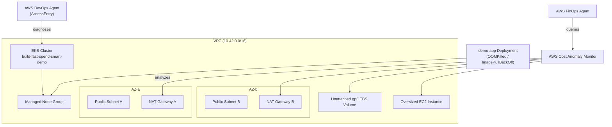

# Build Fast, Spend Smart: Hands-On with AWS FinOps & DevOps Agents

Live demo environment and runbook for the AWS Community Day session
**"Build Fast, Spend Smart: Hands-On with AWS FinOps & DevOps Agents."**

This repo spins up, with a single command, an AWS environment that gives two
native AWS AI agents something real to work with:

1. **AWS DevOps Agent scenario** — an Amazon EKS cluster (with an
   `AWS::EKS::AccessEntry` for the agent's service role) running a
   containerized app that can be flipped into `OOMKilled` (exit code 137) or
   `ImagePullBackOff` failure states on demand.
2. **AWS FinOps Agent scenario** — deliberate cost drivers (multi-AZ NAT
   Gateways, an unattached `gp3` EBS volume, an oversized EC2 instance) paired
   with an AWS Cost Anomaly Monitor so the agent has live signals to analyze.

Everything is destroyed with one command at the end of the session — nothing
is meant to persist.

## Architecture



## Prerequisites

- AWS CLI v2, configured with credentials that can create IAM roles, EKS,
  EC2, and Cost Explorer resources.
- `kubectl`.
- An S3 bucket you own, used only for `aws cloudformation package` staging.
- Python 3 (used by `scripts/deploy_demo.sh` to parse parameter overrides).

## Demo script

0. **(~10 days before the demo) Deploy the persistent Cost Anomaly Monitor once**

   ```bash
   export ANOMALY_ALERT_EMAIL=you@example.com   # optional
   ./scripts/deploy_cost_monitor.sh
   ```

   AWS Cost Anomaly Detection needs about 10 days of continuous history to
   reliably detect anomalies, and that learning resets if the monitor is
   deleted and recreated. This stack is separate from `master.yaml` and
   costs nothing to leave running — do **not** include it in `teardown.sh`.

1. **Configure parameters**

   ```bash
   cp cloudformation/parameters/dev.json.example cloudformation/parameters/dev.json
   # edit dev.json: set DevOpsAgentPrincipalArn, TemplateBucket, etc.
   ```

2. **Deploy the stack**

   ```bash
   export TEMPLATE_BUCKET=your-cfn-package-bucket
   # or with a prefix: export TEMPLATE_BUCKET=s3://all-cf-templates/build-fast-spend-smart/
   export AWS_PROFILE=your-named-profile   # optional, defaults to the default credential chain
   ./scripts/deploy_demo.sh
   ```

   This packages the nested templates, deploys `master.yaml`, points
   `kubectl` at the new cluster, and applies the healthy baseline app.

3. **Trigger a DevOps Agent fault on stage**

   ```bash
   ./scripts/trigger_fault.sh oom          # or: bad-image
   ```

   Use the prompts in [prompts/devops_agent_prompts.md](prompts/devops_agent_prompts.md)
   to have the AWS DevOps Agent diagnose and help resolve the fault. Reset
   with `./scripts/trigger_fault.sh reset`.

4. **Walk through the FinOps Agent scenario**

   Use the prompts in [prompts/finops_agent_prompts.md](prompts/finops_agent_prompts.md)
   against the cost drivers created by `cloudformation/cost-environment.yaml`
   (multi-AZ NAT Gateways, unattached EBS volume, oversized EC2 instance).

5. **Tear everything down**

   ```bash
   ./scripts/teardown.sh
   ```

   Deletes the CloudFormation stack and every nested/billable resource.

## Repository layout

See [.github/copilot-instructions.md](.github/copilot-instructions.md) for
the full directory blueprint and repo conventions.